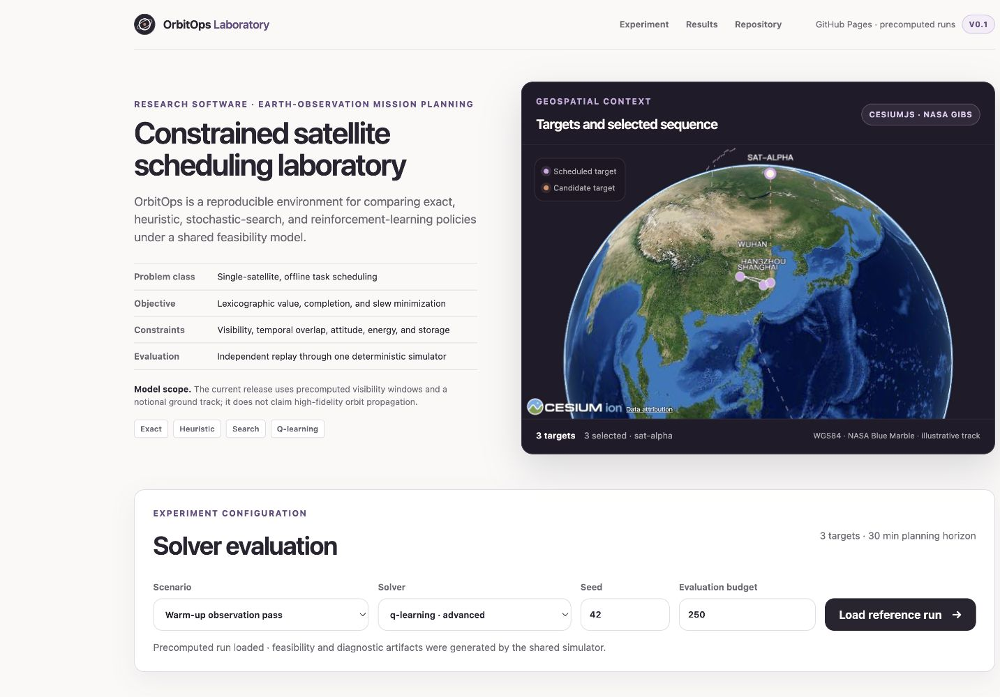
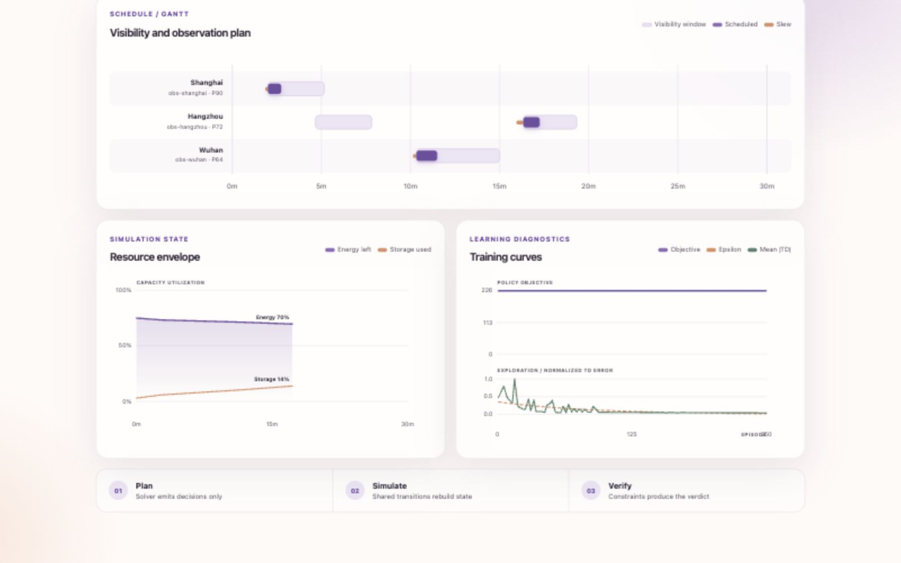

<div align="center">

# OrbitOps Lab

**A reproducible experimental framework for constrained Earth-observation scheduling.**

[](https://www.python.org/)
[](pyproject.toml)
[](https://github.com/Revincxt/orbitops-lab/actions/workflows/ci.yml)
[](LICENSE)

[Open the hosted research interface](https://revincxt.github.io/orbitops-lab/)

From target geometry to a validated schedule, every decision remains reproducible,
inspectable, and backed by the same simulation core.

</div>



## Research objective

Satellite scheduling demos often stop at a score. OrbitOps Lab keeps the whole
evidence chain visible: a solver proposes task assignments, the discrete-event
simulator reconstructs resource state, and the validator independently checks
time windows, overlap, slew, energy, and storage constraints.

The algorithms, simulator, constraint system, benchmark harness, and linear
Q-learning loop are implemented from scratch. Third-party libraries provide
general infrastructure and 3D rendering—not the scheduling answers reported by
the project.

| Explore | Optimize | Verify |
| --- | --- | --- |
| CesiumJS/WGS84 target geometry and observation sequence | 11 baseline, exact, stochastic-search, and learning solvers | One shared simulator, explainable violations, and reproducible artifacts |
| Visibility-aware mission Gantt chart | Seeded budgets and convergence traces | Energy/storage envelopes and feasibility verdicts |
| Q-learning objective, epsilon, and TD-error curves | Branch-and-bound optimality on small instances | Golden, property, unit, and integration tests |

## Experimental evidence



- **3D mission geometry:** an interactive CesiumJS globe places every WGS84
  target on NASA Blue Marble imagery, highlights selected observations, draws
  the scheduled target sequence, and provides an explicitly notional
  orbit-context track. It requires no Cesium ion token, retains a Natural Earth
  fallback, and sends no scenario data to a hosted scheduler.
- **Mission Gantt:** every target receives a row containing all committed
  visibility windows, the selected observation interval, and its preceding slew.
- **Resource envelope:** energy remaining and storage consumed are replayed from
  the authoritative simulator after each observation.
- **Comparative evidence:** the same scenario can be inspected across methods
  using objective value, completion, slew, runtime, evaluation count, and
  stop-reason columns rather than isolated score cards.
- **Constraint audit:** every run exposes resource minima, binding margins,
  omitted-task reasons, exact-search proof status, and stochastic search effort
  when those diagnostics are available.
- **Learning diagnostics:** Q-learning runs expose exploratory episode-schedule
  objective, exploration decay, and normalized mean absolute temporal-difference
  error; pure replayable policy results are separated from the greedy-backed
  hybrid.
- **Honest boundary:** the globe is a mission-context view. High-fidelity orbit
  propagation is deliberately outside v0.1 and is never implied by the display.

## Quick start

```bash
python3 -m venv .venv
source .venv/bin/activate
python -m pip install -e '.[dev]'

orbitops lab --scenarios scenarios
```

Open `http://127.0.0.1:8000`. The Web Lab includes deterministic 6, 10, 18, and
30-task showcase scenarios, method comparison, a 3D mission view, Gantt and
resource envelopes, constraint audit, and learning curves.

The [GitHub Pages interface](https://revincxt.github.io/orbitops-lab/) provides a
serverless reproducibility view. Its committed results use deterministic,
size-aware budgets and report every actual seed, budget, stop reason, omission,
and build provenance. Local execution remains the authoritative mode for
arbitrary seeds, budgets, and new scenarios.

The same domain core is available from the command line:

```bash
orbitops validate scenarios/examples/demo.json
orbitops solve scenarios/examples/demo.json --solver genetic --seed 42 --evaluation-budget 500
orbitops solve scenarios/tiny/tiny-conflict.json --solver branch-and-bound
orbitops benchmark configs/benchmark-smoke.toml --output runs/benchmark-smoke
orbitops train scenarios/examples/demo.json --model-output runs/demo-policy.json --episodes 250
pytest
```

## Solver portfolio

| Family | Implementations | Evidence |
| --- | --- | --- |
| Baseline | random feasible, value, value density, deadline, global insertion | Deterministic contracts and feasibility replay |
| Exact | exhaustive search, branch-and-bound | Optimality on bounded tiny scenarios |
| Search | multi-start local search, genetic algorithm | Seeded evaluation budgets and convergence traces |
| Learning | pure-policy replay and greedy-backed linear Q-learning | Versioned policy JSON, training trace, fingerprint-checked replay |

The objective is lexicographic: maximize total priority value, then completed
task count, then minimize total slew time. Every solver returns decisions through
the same contract and is scored by the same independent simulation path.

## Reproducibility contract

- Immutable, versioned Pydantic models at package boundaries.
- Canonical Scenario, Schedule, and learned-policy JSON Schemas.
- Seeded stochastic solvers, benchmark campaigns, and learning experiments.
- Atomic checkpoints, resumable parallel campaigns, and reproducibility
  fingerprints for reports and scenario-bound policies.
- Scenario-block bootstrap confidence intervals and paired win/tie/loss
  comparisons on normalized, scale-comparable outcomes.
- Strict mypy, Ruff, unit, integration, property, and golden-test coverage.
- Standalone benchmark reports that contain no plotting-framework dependency.

## Repository map

```text
packages/orbitops/
├── domain/          # immutable contracts and lexicographic objective
├── simulation/      # transitions, event replay, resources, validation
├── solvers/         # baseline, exact, search, and Q-learning solvers
├── learning/        # environment, trainer, policy artifact
├── benchmarking/    # scenario generation, campaigns, aggregation
├── reporting/       # standalone HTML benchmark evidence
└── web/             # local API and interactive mission lab

scenarios/           # committed reproducible inputs
schemas/             # versioned JSON contracts
tests/               # unit, integration, property, and golden tests
docs/                # formulation, algorithms, architecture, and evidence
```

## Scopes and documentation

v0.2 models one agile satellite, multiple observation targets, offline planning,
precomputed visibility windows, attitude slew, energy, and storage. Downlink
planning, multi-satellite coordination, high-resolution terrain, time-varying
weather layers, and high-fidelity orbit propagation are deliberate future extensions.

Start with the [problem formulation](docs/problem-formulation.md), then see the
[simulation model](docs/simulation-model.md), [algorithms](docs/algorithms.md),
[benchmarking](docs/benchmarking.md), [visual reports](docs/visual-reports.md),
[Web Lab](docs/web-lab.md), and [reinforcement learning](docs/reinforcement-learning.md).

> **Release scope:** v0.2 retains the versioned v0.1 single-satellite model
> contract while adding 11 solver modes, complex comparative scenarios,
> constraint audit, paired statistical evidence, resumable benchmarks, and
> integrity-checked experiment artifacts. Orbit propagation remains an explicit
> future model-contract extension rather than a visual claim.

> **Policy artifact migration:** v0.2 intentionally moves linear Q-policy files
> to schema v2 because resource-headroom feature semantics changed. Retrain v1
> artifacts with v0.2; old weights are rejected and are not silently migrated.
