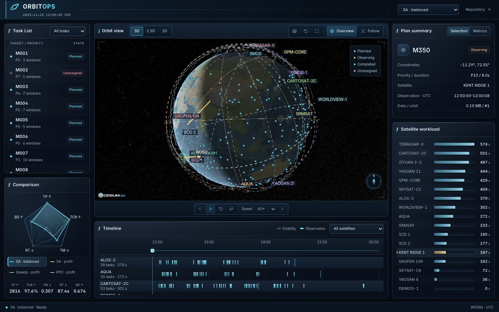

<div align="center">

# OrbitOps Lab

**Earth-observation mission replay and scheduling research.**

[](pyproject.toml)
[](https://github.com/Revincxt/orbitops-lab/actions/workflows/ci.yml)
[](LICENSE)

[Live Demo](https://revincxt.github.io/orbitops-lab/) · [Quick Start](#quick-start) · [Web Lab Guide](docs/web-lab.md)

</div>



## Overview

A fixed-viewport engineering workspace for exploring satellite orbits, observation
tasks and scheduling results. The demo replays one pinned **EOS-Bench** scenario:
**20 satellites · 500 tasks · 12 hours · 4 source plans**.

- **Orbit views** — 3D, 2.5D and 2D maps with satellite models, focus and follow.
- **Mission replay** — forward/reverse playback, UTC navigation and a synchronized satellite timeline.
- **Task inspection** — observation windows, task status, plan details and satellite workloads.
- **Plan comparison** — switch between original source plans and compare five-axis radar metrics.

The Python research core separately provides **11 solvers**, independent schedule
validation and seeded benchmarks for synthetic single-satellite scenarios. The
hosted demo replays reference results; it does not run those solvers.

## Quick Start

Requires **Python 3.12+**. From a terminal:

```bash
git clone https://github.com/Revincxt/orbitops-lab.git
cd orbitops-lab
python3 -m venv .venv
source .venv/bin/activate
python -m pip install -e .
orbitops lab --scenarios scenarios
```

Open [localhost:8000](http://127.0.0.1:8000), or try the
[hosted demo](https://revincxt.github.io/orbitops-lab/) without installation.

## Documentation

[Web Lab](docs/web-lab.md) · [Problem Model](docs/problem-formulation.md) ·
[Algorithms](docs/algorithms.md) · [Benchmarking](docs/benchmarking.md)

## Credits & Scope

Demo records come from [EOS-Bench](https://github.com/Ethan19YQ/EOS-Bench).
Orbit extensions and sensor fields of view are illustrative, not operational
telemetry. See [data provenance and validation scope](docs/web-lab.md#eos-bench-reference-data).

[MIT](LICENSE) applies to OrbitOps-authored code; third-party data is separate.
